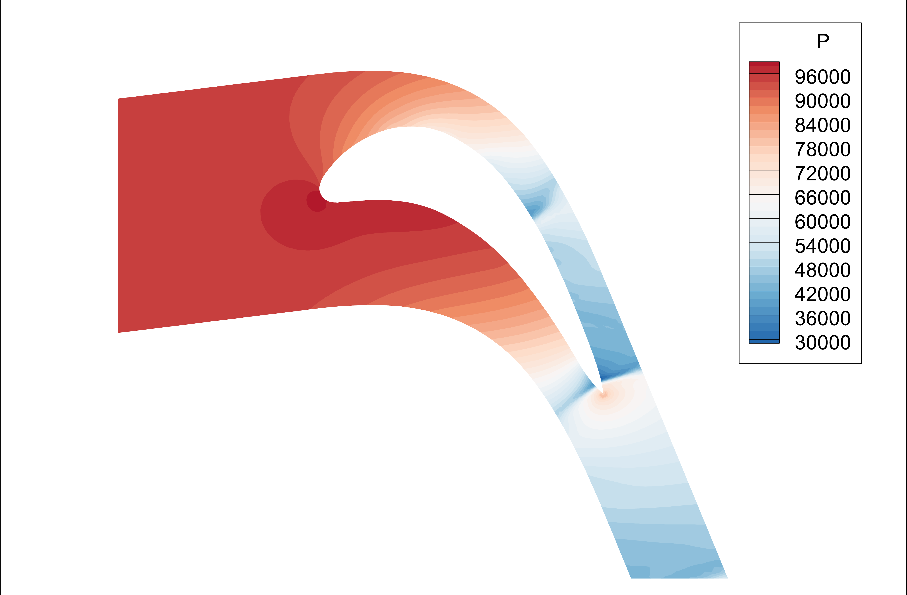

# FVM2D
## Overview
This is an unstructured Finite Volume Method solver for two-dimensional Euler/Navier-Stokes/RANS equation. It is modified based on Jiri Blazek's open source solver. Main characteristics of the solver are:

-  New abstractions of numerical schemes and limiters, extensions of new convection scheme and limter are now decoupled from other part of the program.
-  Current available numerical schemes:
    1. Roe scheme with entropy correction.
    2. AUSM scheme.
    3. AUSM+UP2 scheme.
    4. SLAU2 scheme.
- Current available limiters:
    1. Nishikawa limiter.
    2. Venkatakrishnan limiter.
- Support for meshes with .su2 format instead of the original custom mesh format.
- Support for 2D hybrid meshes. (The code can also read and create control volume for 3D meshes.)
- RANS simulation: currently only the SA turbulent model is implemented.
    
Main details about AUSM+UP2 and SLAU2 schemes can be found in: *Towards shock-stable and accurate hypersonic heating computations: A new pressure flux for AUSM-family schemes*. For the Nishikawa limiters, please refer to *New Unstructured-Grid Limiter Functions*.

## Compile and run

The program is based on CMAKE build system, to build the program, run the following commands under the root directory:

```
cmake -B build
cmake --build build
```

To run the code, use:
```
./main inputfile
```
Make sure the executable program, input file and grid file are under the same directory.

## Gallery

### Euler equations:




### RANS simulations:
rae2822 transonic airfoil:


## Todo:

- [x] LUSGS time scheme for Euler equations.
- [x] LUSGS time scheme for RANS simulations.
- [x] Support for periodic boundary condition.